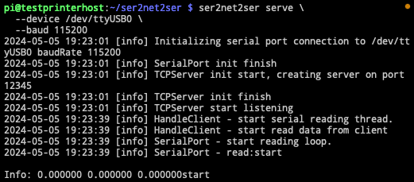
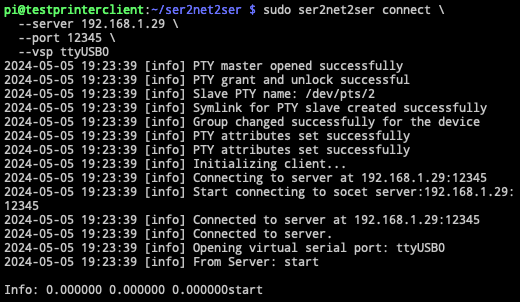

# ser2net2ser

> This still needs testing

## Requirements

- Linux or macOS operating system
- Boost libraries (system, program_options, log_setup, log, date_time)
- CMake for building the project
- Docker (optional) for containerization

## Building the Project

Clone the repository and use CMake to build the project:

```bash
git clone https://github.com/janekbaraniewski/ser2net2ser.git
cd ser2net2ser
make build
```

This will compile both the server and client applications.

## Running the Server

The server needs to be connected to a serial device. It can be started with the following command:

```bash
ser2net2ser serve \
  --device /dev/ttyUSB0 \
  --baud 9600 \
  --port 12345
```

```text
--device: Specifies the serial device.
--baud: Sets the baud rate for the serial device.
--port: TCP port on which the server will listen for incoming connections.
```



## Running the Client

The client should be run on the machine where you want the virtual serial port to be created:

```bash
ser2net2ser connect \
  --server 192.168.1.100 \
  --port 12345 \
  --vsp "tty.usbserial-666"
```

```text
--server: IP address of the server.
--port: TCP port on which the server is running.
--vsp: Name of the virtual serial port to be created.
```



## Docker Containers

Dockerfiles for both the server and client are included. Build and run the containers using:

```bash
make build-images
```
